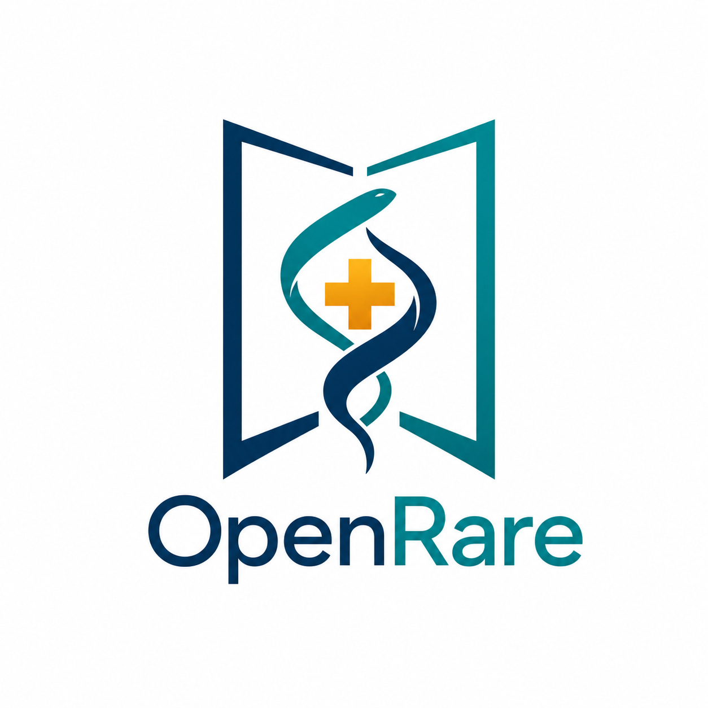

# OpenRare



## OpenRare Rare Disease Agent

**An Explainable AI System for Rare Disease Variant Prioritization**

Rare Disease Agent 是一个面向罕见病诊断场景的开源基因分析系统。

我们的目标不是替代临床医生进行诊断，而是帮助医生在海量基因变异中更高效地发现最有可能解释患者表型的候选致病变异，并提供可追溯、可解释、可审计的证据链。

系统融合患者临床表现、基因测序数据、生物医学知识库以及 AI Agent 技术，构建从症状理解、变异注释、致病性排序到报告生成的完整分析流程。

---

## Why

对于大多数罕见病患者而言，获得基因测序结果只是诊断流程的开始。

一次全外显子组（WES）或全基因组（WGS）测序通常会产生数百万个变异位点，即使经过常规过滤，仍然可能剩余数百至数千个候选变异。

真正困难的问题是：

> **哪一个变异最有可能解释患者的临床症状？**

目前医生通常需要同时查阅：

- 症状与疾病数据库
- 基因与疾病关联研究
- 人群频率数据库
- ClinVar 等临床证据库
- 剪接预测工具
- 蛋白功能预测工具
- 文献与病例报告

整个过程耗时且高度依赖经验。

Rare Disease Agent 希望将这些分散的信息整合到统一分析框架中，为医生提供更加高效、透明和标准化的辅助决策支持。

---

## System Overview

整个系统由五个核心模块组成：

```
Patient Clinical Data
        │
        ▼
 Symptom Understanding
        │
        ▼
 Variant Annotation Engine
        │
        ▼
 Evidence Integration Layer
        │
        ▼
 Variant Prioritization Engine
        │
        ▼
 ACMG Interpretation
        │
        ▼
 Agent Generated Report
```

### 1. Symptom Understanding

患者的临床描述往往来源于病历记录、医生问诊记录或自由文本输入。

**例如：**

> 从小肌无力、容易跌倒、无法抬肩、运动能力逐渐下降

系统利用大语言模型结合医学知识库：

- 识别症状实体
- 标准化医学术语
- 映射至 HPO（Human Phenotype Ontology）
- 构建结构化表型数据

**输出示例：**

- Muscle weakness
- Gait instability
- Frequent falls
- Scapular winging

形成后续分析所需的标准化 HPO Profile。

### 2. Variant Annotation & Evidence Aggregation

系统支持：

- WES（全外显子组测序）
- WGS（全基因组测序）
- Long-read Sequencing（长读长测序）

等主流测序方案。

对于每个变异位点，系统会构建包含 200+ 字段的综合证据宽表。

#### 整合内容

**Population Evidence**
- gnomAD
- 1000 Genomes
- ExAC

**Clinical Evidence**
- ClinVar
- OMIM
- Orphanet
- MONDO

**Functional Prediction**
- CADD
- REVEL
- dbNSFP
- AlphaMissense

**Splicing Prediction**
- SpliceAI

**Transcript Annotation**
- MANE
- Canonical Transcript

**Regulatory Annotation**
- Promoter
- Enhancer
- UTR
- Non-coding Region

**Expression Evidence**
- GTEx

**Sequencing Evidence**
- Read Quality
- Coverage
- Phasing

**Structural Context**

最终形成统一的 Variant Evidence Table。

### 3. Phenotype-Aware Disease Gene Scoring

仅依赖变异危害性往往不足以解释患者疾病。

因此系统引入表型解释评分模块。

**核心问题：**

> 该基因已知疾病表型与患者表型之间是否匹配？

**系统流程：**

1. 提取候选基因
2. 查询 OMIM / Orphanet / MONDO / HPOA
3. 构建 Gene-Disease-HPO 图谱
4. 计算患者 HPO 与疾病 HPO 的语义相似度

**输出：**

- Gene Score
- Variant Score

**需要强调：**

Gene Score 表示：

> "该基因已知疾病谱与患者表型的匹配程度"

而非：

> "该基因一定致病"

最终诊断仍需结合 ACMG、家系信息、遗传模式以及临床证据共同判断。

### 4. Protein Interaction Network Scoring

许多罕见病尚未发现明确致病基因。

因此系统引入蛋白互作网络（PPI）分析。

**核心思想：**

> 如果候选基因位于已知疾病基因附近，或参与同一生物学功能模块，则其致病可能性更高。

**分析内容包括：**

- Protein-Protein Interaction
- Pathway Network
- Tissue-specific Network
- Functional Module Enrichment

**该模块能够：**

- 提升新候选基因发现能力
- 提供机制层面的解释
- 支持后续功能验证研究

### 5. Explainable Variant Prioritization Engine

这是系统的核心。

**目标：**

在数百万变异中排序出最可能的致病变异。

#### Design Principle

我们没有选择让大语言模型直接给出诊断结果。

**原因在于：**

临床场景需要：

- ✅ 可解释
- ✅ 可复现
- ✅ 可审计
- ✅ 可追溯

而医生需要理解：

> **为什么这个变异排在第一位？**

因此生产环境采用确定性评分模型，而不是黑盒推理。

#### Four-Layer Architecture

**Layer 0 — Scoring Engine**

固定评分贡献者：

- ClinVar
- Consequence
- LoF / Splicing
- Prediction
- Population Frequency
- Functional Domain

所有特征转换为标准化数值后进入统一评分框架。

**Layer 1 — Evaluation Framework**

支持：

- MRR（Mean Reciprocal Rank）
- Recall@K
- Bootstrap Confidence Interval
- Failure Attribution
- Provenance Tracking

用于严格评估排序质量。

**Layer 2 — Numerical Optimization**

使用：

- CMA-ES
- TPE
- Optuna

自动寻找最优评分参数。

**优化目标：**

```
Ranking Margin Maximization + Regularization
```

保证模型稳定性与泛化能力。

**Layer 3 — Agent Self-Improvement Loop**

Agent 不直接参与临床决策。

Agent 的职责是：

1. 分析失败案例
2. 提出评分改进假设
3. 自动开展交叉验证
4. 验证是否真正提升性能

只有通过验证的改进才会被纳入下一版本评分模型。

**工作流程：**

```
Agent
    ↓
Train Better Scoring Formula
    ↓
Freeze Formula
    ↓
Clinical Deployment
```

最终交付给医生的是：

- 固定版本
- 可审计
- 可复现

的排序模型。

### 6. ACMG Classification

在候选变异排序完成后，系统进一步结合：

- ACMG/AMP Guidelines
- ClinVar Evidence
- Population Data
- Functional Evidence
- Segregation Evidence

生成标准化致病性分类：

| 分类 | 说明 |
|------|------|
| Benign | 良性 |
| Likely Benign | 可能良性 |
| VUS | 意义未明变异 |
| Likely Pathogenic | 可能致病 |
| Pathogenic | 致病 |

并提供对应证据链。

### 7. Agent-Generated Reports

系统输出两类报告：

#### Clinical Report

**面向：**

- 临床医生
- 遗传咨询师

**重点关注：**

- 候选变异
- ACMG证据
- 诊断依据

#### Research Report

**面向：**

- 科研人员
- 生物学家

**重点关注：**

- 机制解释
- 文献支持
- PPI网络
- 潜在研究方向

### 8. Interactive Platform

系统提供 Web 平台。

用户能够：

- 上传测序数据
- 查看分析过程
- 浏览原始证据
- 查询数据库来源
- 与 Agent 针对单个变异进行多轮讨论

实现从数据到证据链的透明化分析流程。

---

## Vision

Rare Disease Agent 致力于构建一个开放、透明、可解释的罕见病智能分析平台。

我们相信 AI 在罕见病领域最重要的价值并不是替代医生做出诊断，而是帮助医生更快地发现证据、更系统地组织知识，并将有限的临床经验放大到更多患者身上。

**最终目标：**

> 将数百万个基因变异缩小到少数真正值得关注的候选位点，让每一个罕见病患者更快接近正确诊断。